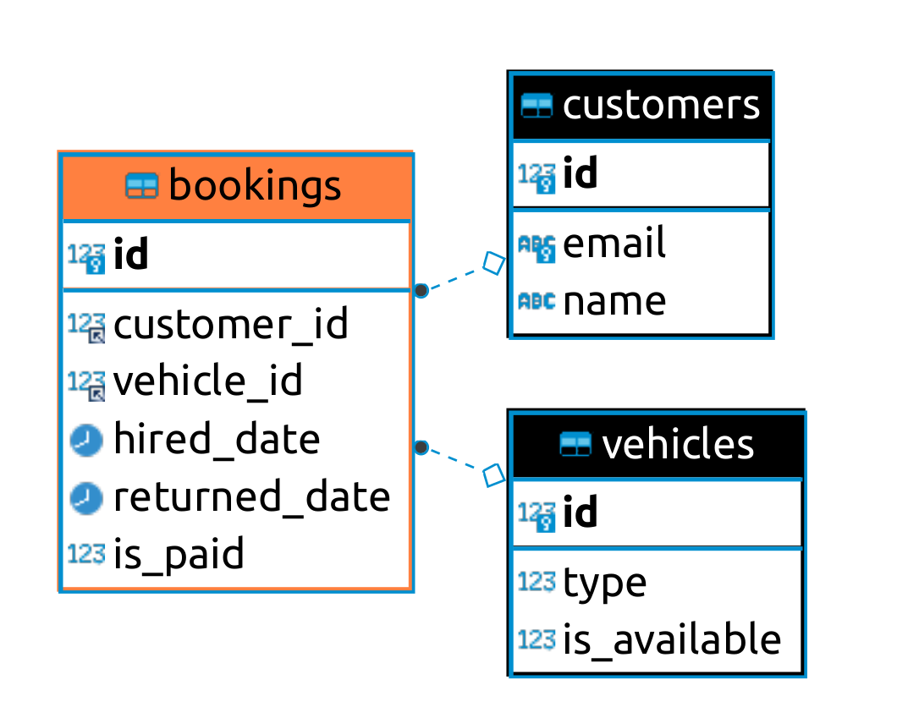

- [1. Explain source code](#1-explain-source-code)
- [2. Deploy on local](#2-deploy-on-local)
	- [2.1. Install mysql server](#21-install-mysql-server)
	- [2.2. Configure mysql server in source code](#22-configure-mysql-server-in-source-code)
	- [2.3. Run project](#23-run-project)
	- [2.4. Test](#24-test)
- [3. ERD diagram](#3-erd-diagram)


# 1. Explain source code

[app/main.py](app/main.py) : all api and endpoint are declare here

[app/mysql_ulities.py](app/mysql_utilities.py) : all logic related to mysql here. Because you told me don't use ORM, so I choose `pymysql` library with raw SQL.

[app/enums.py](app/enums.py) : define types of Vehicle

# 2. Deploy on local

## 2.1. Install mysql server

Install directly mysql to your computer or using docker. Here, I use docker with below configurations :

```shell
docker run -d --name test-mysql \
	-p 3306:3306 \
	-v /tmp/test-mysql-data:/var/lib/mysql/ \
	-e MYSQL_ROOT_PASSWORD=passwd \
	-e MYSQL_USER=user \
	-e MYSQL_PASSWORD=passwd \
	-e MYSQL_DATABASE=db \
	mysql:5.7 \
	--character-set-server=utf8 \
	--collation-server=utf8_unicode_ci
```

## 2.2. Configure mysql server in source code

Change mysql configuration in file : [app/mysql_ulities.py](app/mysql_ulities.py)

## 2.3. Run project

Environment:

	ubuntu 20
	python 3.8.0


Run below command:

```shell
pip install requirements.txt
cd app
python main.py
```

## 2.4. Test

```shell
make create-customer
```

change cutomer id in Makefile for remain commands, then run :

```shell
make get-customer
make update-customer
make delete-customer
```

# 3. ERD diagram



If you don't see image, please open file [ERD.png](ERD.png) in this project.

SQL which implements above ERD is in file : [app/mysql_ulities.py](app/mysql_ulities.py)
